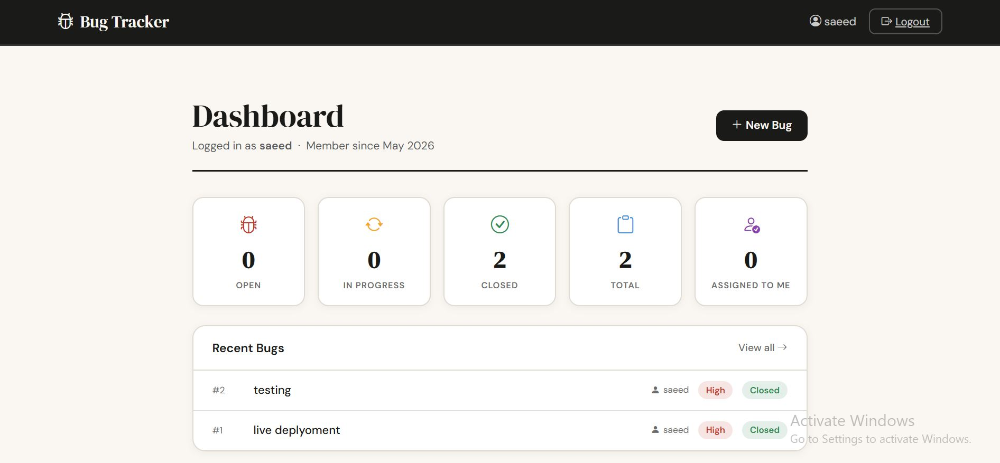
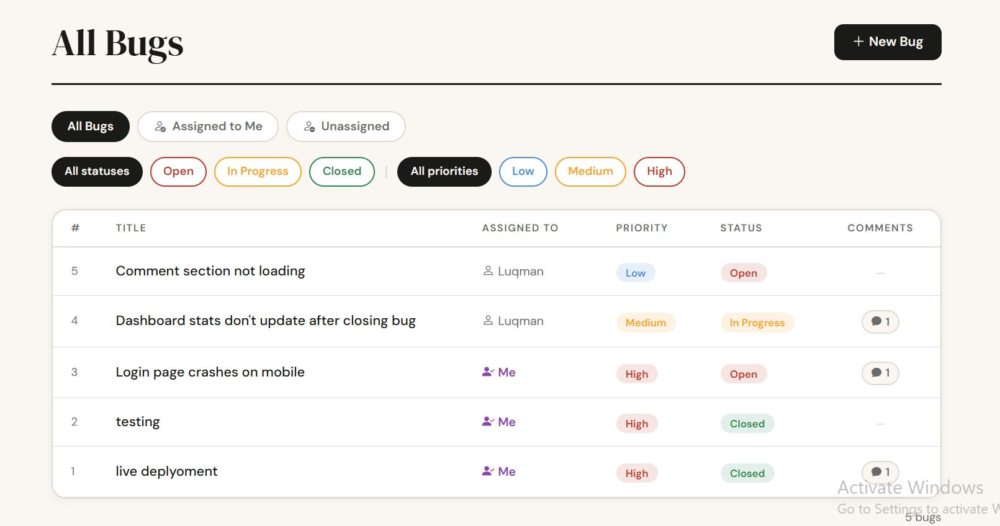
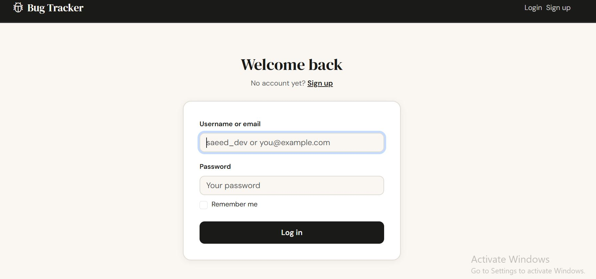
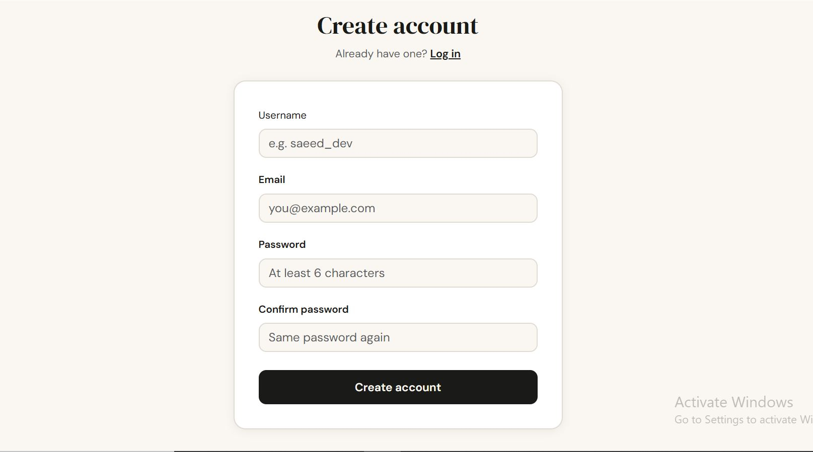

🐛 Bug Tracker

A full-stack bug tracking system with user authentication, team assignment, and comment threads — built for small software teams and startups.
Flask Python PostgreSQL AWS EC2 AWS RDS Bootstrap

📌 Project Overview

Bug tracking is essential for software development teams, but tools like Jira can be expensive and overkill for small teams. This project provides a lightweight, self-hosted alternative that handles user authentication, bug assignment, status tracking, and team collaboration — all deployed on AWS.

The core challenge: building a secure, multi-user system with role-based bug assignment and real-time dashboard statistics.

**Live Demo:** http://13.61.33.248:5000

---

## 👥 Who is this for?

This project is suited for software development teams who need a simple, lightweight way to track bugs. It's great for small startups, student projects, or internal team use where you don't want to pay for expensive tools like Jira.

---

## 📸 Screenshots

| Dashboard | Bug List |
|-----------|----------|
|  |  |

| Login | Signup |
|-------|--------|
|  |  |

---

## ⚙️ Features Overview
User Signup/Login
↓
Dashboard (Bug Statistics)
↓
Create Bug → Assign to Team Member
↓
Update Status (Open → In Progress → Closed)
↓
Add Comments → Filter by Assignee

text

---

## 🛠️ Tech Stack

| Layer | Technology |
|-------|------------|
| Backend | Flask (Python) |
| Database | PostgreSQL (AWS RDS) |
| ORM | SQLAlchemy |
| Frontend | HTML, Bootstrap 5, Jinja2 |
| Authentication | Flask-Login |
| Deployment | AWS EC2, Gunicorn, systemd |
| Version Control | Git + GitHub |

---

## 📊 Features Breakdown

| Feature | Description |
|---------|-------------|
| User Authentication | Signup, login, logout with password hashing |
| Bug Lifecycle | Create, list, view, update status |
| Team Assignment | Assign bugs to other users |
| Filter by Assignee | "All Bugs", "Assigned to Me", "Unassigned" |
| Comment Threads | Add and delete comments on bugs |
| Dashboard | Real-time counts by status and assignment |

---

## 🔑 Key Findings

- **Flask-Login** provides simple but secure session management
- **SQLAlchemy** makes switching databases seamless (SQLite → PostgreSQL)
- **systemd** keeps the app running after SSH logout
- **AWS RDS** with public access requires careful security group configuration
- **Environment variables** should never be hardcoded in production

---

## 🚀 Deployment Architecture
User → Browser → EC2 (Gunicorn) → RDS (PostgreSQL)
↓
systemd (auto-restart on failure)

text

| Component | Specification |
|-----------|---------------|
| EC2 | Ubuntu 22.04, t3.micro (free tier) |
| RDS | PostgreSQL, single-AZ, public access |
| Security | Port 22 (SSH), 80 (HTTP), 5000 (app) |
| Process Manager | systemd for auto-start on reboot |

---

## 🛠️ How To Run Locally

```bash
# Clone the repository
git clone https://github.com/SaeedSwaleh/bug-tracker-flask.git
cd bug-tracker-flask

# Create virtual environment
python -m venv venv

# Activate it (Windows)
venv\Scripts\activate

# Install dependencies
pip install -r requirements.txt

# Run the app
python app.py
Open http://localhost:5000

📦 Dependencies
text
flask>=3.0.0
flask-login>=0.6.3
flask-sqlalchemy>=3.1.1
psycopg2-binary>=2.9.9
gunicorn>=21.2.0
Install all with:

bash
pip install -r requirements.txt
💡 Future Improvements
HTTPS & Custom Domain – SSL certificate via AWS ACM

Email Notifications – AWS SNS alerts for bug assignment

File Attachments – Upload files to AWS S3

Password Reset – Forgot password flow with email confirmation

Bug History Log – Track all changes to each bug

Search & Filters – Advanced filtering and keyword search

Role-Based Permissions – Admin, Developer, Viewer roles

REST API – For mobile app integration

Unit Tests – pytest coverage for models and routes

CI/CD Pipeline – GitHub Actions for automated deployment

👤 Author
Saeed Hassan Swaleh – GitHub: SaeedSwaleh – hassansaeed652@gmail.com

Live Demo: http://13.61.33.248:5000

Project Link: https://github.com/SaeedSwaleh/bug-tracker-flask